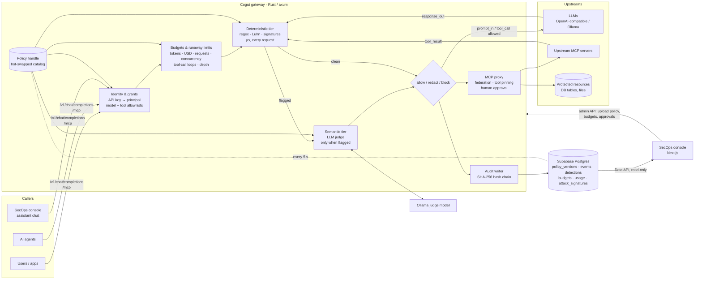

# 2 · Architecture

## Diagram

An interactive version with every component and request path is
[`architecture.html`](architecture.html) (open it in a browser). The
full backend specification is [`BACKEND.md`](BACKEND.md).

### Request path

1. **Authenticate** — `Authorization: Bearer <key>` resolves to a principal
   (SHA-256 of the key); unknown callers get nothing. A delegating principal (the
   console) may name the end user in `X-On-Behalf-Of`, so budgets and risk follow the
   person, not the app.
2. **Grants and budgets** — model allow/deny list (global, then per principal), tool
   and table grants, budget rows, runaway limits, the identity's risk score.
3. **Deterministic tier** at the hook (`prompt_in`, `response_out`, `tool_call`,
   `tool_result`) — controls run in catalog order; a redaction rewrites the text the
   next control sees; block beats redact.
4. **Semantic tier** — only if step 3 flagged something, or the identity's risk score
   is past `escalate_at`. A judge error or timeout follows the control's `fail_mode`
   (closed by default).
5. **Forward** to the LLM or MCP server, then run steps 3–4 again on the answer or
   tool result. Streaming answers are checked delta by delta with a held-back tail,
   so a secret split across chunks is never sent in clear.
6. **Audit** — one `events` row per decision plus `detections`, chained by
   `prev_hash → hash`; `just verify-audit` proves the chain is intact.

### Design choices

| Choice | Why |
|---|---|
| Gateway, not SDK | Integration is a base-URL change; no agent code to modify; one enforcement point for every language and framework. |
| Rust / axum / tokio | Microsecond deterministic tier, no GC pauses on the hot path, one static binary per Cloud Run instance. |
| Hybrid tiers with `escalate_when = "suspicious"` | Clean traffic never pays model latency; the semantic judge only sees what the cheap tier is unsure about. |
| Catalog in the database, `ArcSwap` handle | Every instance converges on the same version in ≤ 5 s; in-flight requests keep their version; a bad upload never replaces a good one. |
| Fail closed by default | A control layer that fails open under load is not a control. Overridable per control. |
| Hash-chained, append-only audit; console has no write path (RLS) | The thing that displays the log cannot rewrite it. |
| Models never see resource rows | `resources__query` returns a row count and a `result_id`; rows go to the user, redacted. The model cannot leak rows it never received. |

## Performance metrics

### Deterministic tier (measured)

Full shipped catalog (`Policy::builtin()`: 23 controls at `prompt_in`, 30 at
`response_out`, 35 at `tool_call`, 36 at `tool_result`, signatures included),
release build, 5,000 timed iterations after warm-up, single core of an Apple M5:

| Input | Size | Verdict | p50 | p95 | p99 |
|---|---:|---|---:|---:|---:|
| clean short prompt | 30 B | allow | 0.9 µs | 0.9 µs | 1.1 µs |
| prompt with email + PESEL | 62 B | redact | 2.0 µs | 2.4 µs | 2.5 µs |
| prompt with AWS key | 36 B | block | 1.3 µs | 1.6 µs | 1.7 µs |
| injection attempt | 62 B | flag → escalate | 1.5 µs | 1.6 µs | 1.9 µs |
| clean MCP tool call | 53 B | allow | 1.5 µs | 1.5 µs | 1.8 µs |
| clean prompt | 4.2 KB | allow | 43.7 µs | 49.8 µs | 56.9 µs |
| clean tool result | 4.2 KB | allow | 88.2 µs | 104.9 µs | 113.7 µs |

Scaling is linear in input size (~10–20 µs per KB with all controls on) — orders of
magnitude below the latency of the LLM call it guards.

### Semantic tier (bounded, measured live)

The semantic tier's cost is set by the judge model and hardware, so it is measured
in the running system rather than in a micro-benchmark:

- It runs **only on escalated traffic**; the share is reported as
  `escalation_rate`. Clean requests add 0 µs of model latency.
- Each judge call is capped by the control's `timeout_ms` (2,000 ms for
  `injection.prompt-guard` and `exfiltration.intent`); past it the control's
  `fail_mode` decides.
- Per-tier latency is recorded on every event (`events.latency =
  {deterministic_us, semantic_us, upstream_us}`).

### Where to read live telemetry

| Endpoint / view | What |
|---|---|
| `GET /metrics` (security_admin key) | 24 h report: deterministic p50/p95, semantic p50/p95, escalation rate, totals, budgets, chain status |
| `GET /metrics/prometheus` | `gateway_stage_latency_us{stage=deterministic\|semantic\|semantic_async\|upstream\|mcp_upstream\|total, quantile}`, `gateway_verdicts_total{hook,verdict}`, `gateway_dependency_calls_total{dependency,outcome}`, `gateway_semantic_queue_depth` |
| Console → **Overview** | p95 overhead tile |
| Console → **Gateway** | Deterministic p50 / p95, Semantic p50 / p95, live health |
